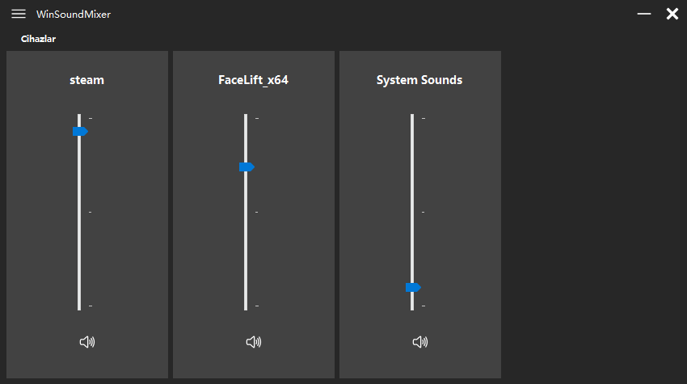
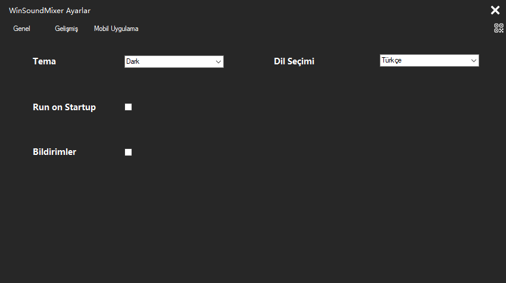

# Windows Ses Düzeyi Karıştırıcısı (Gelişmiş)

Bu uygulama, Windows ses düzeyi karıştırıcısının geliştirilmiş bir versiyonudur. Uygulama, ses çıkışı cihazlarının ve uygulamaların ses düzeylerini detaylı şekilde kontrol etmenize olanak tanır. Gelecekte mobil uygulamasıyla da uyumlu olacak şekilde tasarlanmıştır.

---

## 🎥 Ekran Görüntüleri

### Ana Ekran

### Ayarlar Sekmesi

---

## 🎯 **Özellikler**

- 🎧 **Ses Çıkışı Cihazlarını Kontrol Etme:** Her bir cihazın ses düzeyini ve tercihlerini kolayca yönetebilirsiniz.
- 🔊 **Uygulamaların Ses Düzeylerini Kontrol Etme:** Tek tek uygulamalar için ses seviyesini ayarlayın.
- 📱 **Mobil Uygulama Desteği (Yakında):** Mobil uygulama ile masaüstü uygulamasını uzaktan kontrol etme imkanı.
- 🌍 **Çoklu Dil Desteği:** Birden fazla dil seçeneği ile kullanımı kolaylaştırır.
- 🌙 **Koyu Tema:** Göz yormayan, şık bir koyu tema seçeneği.
- 🔄 **Otomatik Güncelleme (Beta):** Güncellemeleri kontrol eder ve indirir (Henüz tamamlanmamış).

---

## 🛠️ **Kullanım**

1. Uygulamayı çalıştırın.
2. **Cihazlar** sekmesinden ses çıkışı cihazlarınızı seçin ve ses düzeylerini ayarlayın.
3. **Uygulamalar** sekmesinden belirli uygulamaların ses düzeylerini kontrol edin.
4. **Ayarlar** bölümünden çoklu dil desteği, tema seçimi ve otomatik güncelleme özelliklerini yapılandırabilirsiniz.

---

## 📚 **Geliştirme Durumu**

| Özellik                | Durum            |
|------------------------|------------------|
| Ses Çıkışı Kontrolü    | Tamamlandı       |
| Uygulama Ses Kontrolü  | Tamamlandı       |
| Çoklu Dil Desteği      | Beta             |
| Koyu Tema              | Tamamlandı       |
| Otomatik Güncelleme    | Beta             |
| Mobil Uygulama         | Planlanıyor      |

---

## 🌟 **Gelecek Planları**

- 📱 Mobil uygulamanın geliştirilmesi.
- 🔄 Otomatik güncelleme sisteminin tamamlanması.
- 🌟 Daha fazla özelleştirilebilir tema seçenekleri.
- 🌍 Daha fazla dil desteği.

---